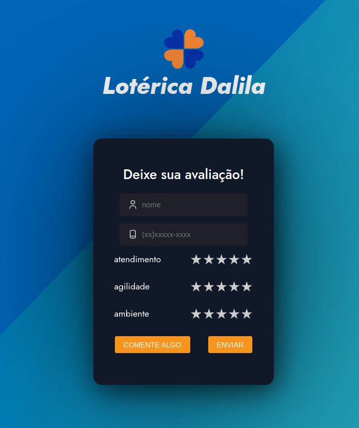
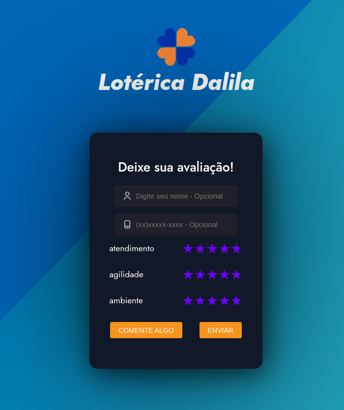
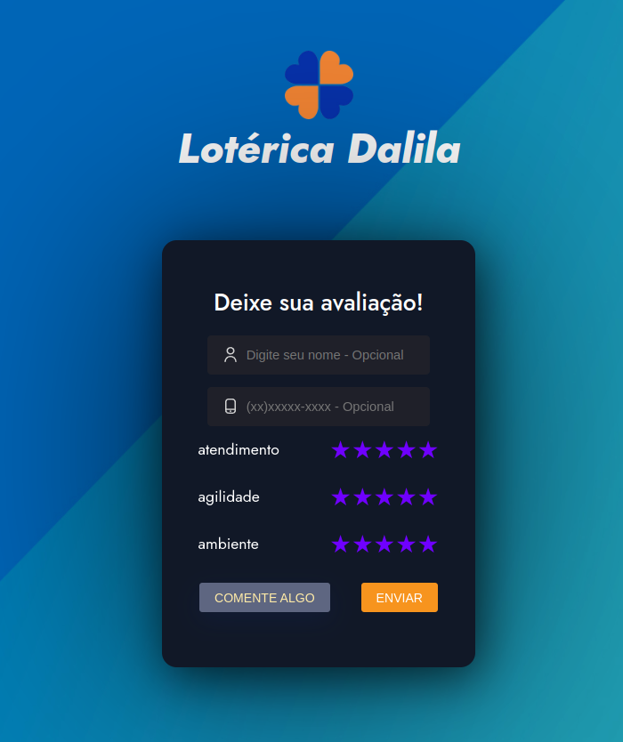
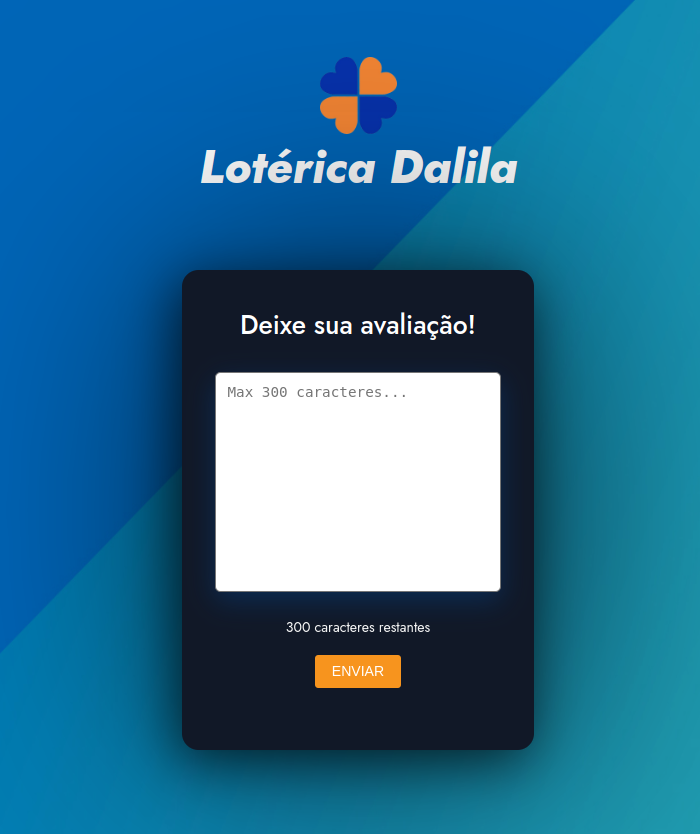
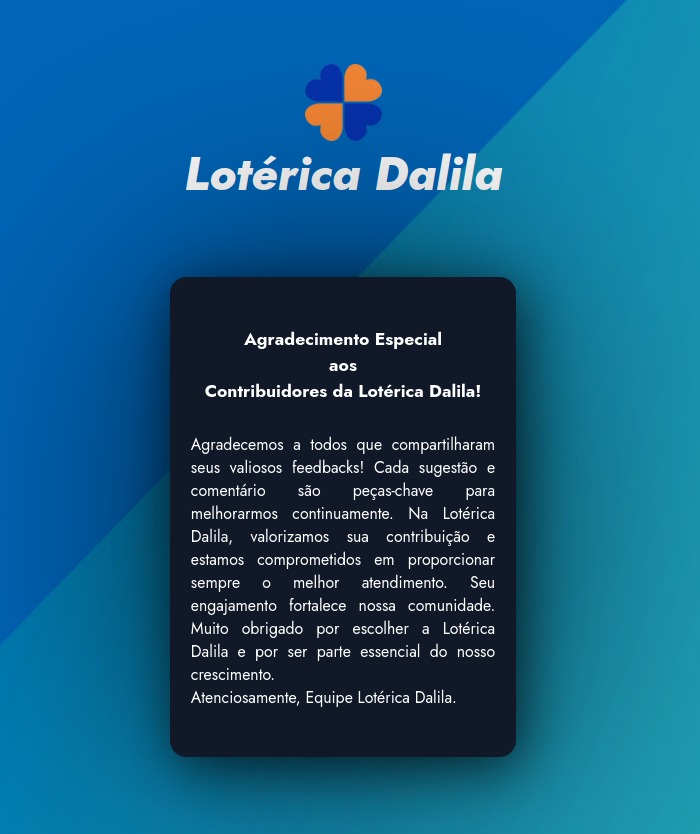

# Welcome to Loterry-Feedback 

This is a small application developed to receive your evaluations about our lottery house. We are constantly striving to improve our services, and your feedback is crucial to us.

Please feel free to share your experiences with us. Your evaluation is anonymous and will help us understand how we can better serve you.

Thank you for taking a moment to provide us with your feedback. We look forward to hearing what you have to say!

# Bem-vindo à Avaliação da Casa Lotérica
Este é um pequeno aplicativo desenvolvido para receber suas avaliações sobre nossa casa lotérica. Estamos constantemente buscando melhorar nossos serviços e sua opinião é fundamental para nós.

Por favor, sinta-se à vontade para compartilhar suas experiências conosco. Sua avaliação é anônima e nos ajudará a entender como podemos melhor atendê-lo.

Obrigado por dedicar um momento para nos fornecer seu feedback. Estamos ansiosos para ouvir o que você tem a dizer!

Developers: Yago Cruz 👨‍💻 & Iesley Ferreira 👨‍💻 - ⚛️

📸 👇

  
<b>Project Illustration</b>

  

    
    
    
    
    
  

 

